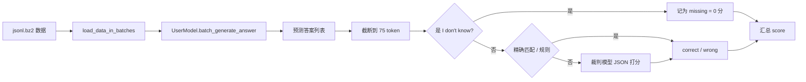

# 04 · 项目代码解析（快速入门）

> 整理日期：2026-08-21  
> 目标：用最短时间搞清 **仓库在干什么、数据怎么流、三个基线原理差在哪**。  
> 动手跑机请看：[03-AutoDL单卡24GB操作手册.md](./03-AutoDL单卡24GB操作手册.md)

---

## 1. 一句话理解本项目

**CRAG = 评测脚手架 + 三套示例 RAG/LLM 方案 + 模拟知识图谱 API。**

你要做的事本质是：实现一个 `UserModel`，吃进「问题 +（可选）网页检索结果 +（可选）KG API」，吐出简短答案；`local_evaluation.py` / `local_evaluation_deepseek.py` 负责批量调用你并打分。

---

## 2. 目录地图（只看重要的）

```
CRAG/
├── local_evaluation.py            # 总控：读数据 → 调模型 → 裁判打分（默认 GPT）
├── local_evaluation_deepseek.py   # 同上，裁判改为硅基流动 DeepSeek
├── .env                           # DATASET_PATH / API Key 等（勿提交）
├── models/                        # 你的模型入口 + 三个官方基线
│   ├── user_config.py             # ★ 选哪个模型当 UserModel
│   ├── dummy_model.py             # ★ 接口合同（照这个写）
│   ├── vanilla_llama_baseline.py  # 基线1：只用 LLM，不用检索
│   ├── rag_llama_baseline.py      # 基线2：网页 HTML → 句子检索 → LLM
│   └── rag_knowledge_graph_baseline.py  # 基线3：网页 RAG + Mock KG
├── prompts/templates.py           # 自动评估裁判的提示词
├── tokenizer/                     # 仅用于评估时截断到 75 token
├── utils/cragapi_wrapper.py       # 调 Mock API 的 HTTP 客户端
├── mock_api/                      # FastAPI 模拟知识图谱服务
├── example_data/                  # 小样本 / 100 条子集
├── api_responses/                 # 裁判 API 原始回复落盘（调试用）
└── docs/                          # 数据集、基线、操作手册
```

---

## 3. 核心原理：端到端流水线



### 3.1 数据进模型

每条样本大致包含：

| 字段 | 作用 |
|------|------|
| `query` | 用户问题 |
| `query_time` | 提问时间（动态事实需要） |
| `search_results` | 预缓存的网页（含完整 HTML `page_result`） |
| `answer` | 金标准答案（评估用，生成阶段会 pop 掉） |

模型**看不到** `answer`；只能用 query / time / search_results（以及自己调的 Mock API）。

### 3.2 你必须实现的接口

见 `models/dummy_model.py`：

```python
class XxxModel:
    def get_batch_size(self) -> int: ...
    def batch_generate_answer(self, batch: dict) -> list[str]: ...
```

`batch` 键：`interaction_id`、`query`、`search_results`、`query_time`。  
输出：与 batch 等长的字符串答案列表。

选模型：改 `models/user_config.py` 里的 `UserModel = ...`。

### 3.3 评分原理（很重要）

每条预测归为三类：

| 类型 | 单条贡献 | 典型情况 |
|------|----------|----------|
| correct | **+1** | 与金标一致（规则或裁判判对） |
| missing | **0** | 答案里含 `i don't know`（宁可不知也不要瞎编） |
| incorrect | **-1** | 错答 / 幻觉 |

总公式：

```text
score = (2 * n_correct + n_miss) / n - 1
```

等价于：正确拉高分、胡编重罚、说不知道不奖不罚。  
裁判提示词在 `prompts/templates.py`；可用 GPT（`OPENAI_API_KEY`）或 DeepSeek（`.env` 里硅基流动配置）。

竞赛约束（写在 Dummy 注释里）：单条约 **30s** 内答完；答案评估侧截断 **75 token**。

### 3.4 完整例子：一条数据从进到出（Vanilla + DeepSeek 裁判）

假设你当前配置是：

- `models/user_config.py` → `UserModel = InstructModel`（Vanilla）
- 运行：`python local_evaluation_deepseek.py`
- `.env` 里 `DATASET_PATH=example_data/dev_subset_100_random.jsonl.bz2`

下面用**虚构但结构真实**的一条样本，走完一遍调用链。

#### ① 磁盘上的一条 JSON（压缩在 bz2 里）

```json
{
  "interaction_id": "abc-001",
  "query_time": "03/01/2024, 00:00:00 PT",
  "query": "who authored The Taming of the Shrew?",
  "answer": "william shakespeare",
  "search_results": [
    {
      "page_name": "...",
      "page_url": "https://...",
      "page_snippet": "...",
      "page_result": "<html>...很长的 HTML...</html>",
      "page_last_modified": "..."
    }
  ]
}
```

（真实数据还会有 `domain`、`question_type` 等字段；评测生成阶段只用到上表里那几个键。）

#### ② 启动脚本做了什么

1. `load_dotenv()` 读 `.env` → 拿到 `DATASET_PATH`、`SILICONFLOW_API_KEY`、`EVALUATION_MODEL_NAME=deepseek-ai/DeepSeek-V3.2`
2. `from models.user_config import UserModel` → 实际拿到 `InstructModel`
3. `participant_model = UserModel()` → 构造函数里 **加载本地 Llama 权重到 vLLM**（这一步最慢、最吃显存）
4. 调用 `generate_predictions(DATASET_PATH, participant_model)`
5. 再调用 `evaluate_predictions(...)` 打分

#### ③ 生成阶段：`generate_predictions`

伪代码顺序：

```text
batch_size = participant_model.get_batch_size()   # Vanilla 里是 BATCH_SIZE=4
for batch in load_data_in_batches(DATASET_PATH, 4):
    answers = batch.pop("answer")                 # ★ 金标拿走，模型看不到
    preds = participant_model.batch_generate_answer(batch)
    把 query / answer / pred 追加到三个大列表
```

当轮到包含 `abc-001` 的那个 batch 时，传入模型的大致是：

```python
batch = {
  "interaction_id": ["abc-001", "...最多共 4 个..."],
  "query": ["who authored The Taming of the Shrew?", "..."],
  "query_time": ["03/01/2024, 00:00:00 PT", "..."],
  "search_results": [[{...HTML...}], ...],
}
# 注意：这里已经没有 "answer" 了
```

#### ④ Vanilla 模型内部（`InstructModel.batch_generate_answer`）

1. 读出 `queries`、`query_times`（也会读到 `search_results`，但 **Vanilla 故意不用**）
2. `format_prommpts` 拼出聊天模板，用户侧类似：

```text
Current Time: 03/01/2024, 00:00:00 PT
Question: who authored The Taming of the Shrew?
```

3. `self.llm.generate(...)`（vLLM）生成短答，例如：

```text
william shakespeare
```

4. 返回 `["william shakespeare", ...]` 给评测脚本

若换成 RAG 基线，同一步会先从 HTML 抽句子、向量检索，再把 `# References` 塞进 prompt——**接口不变，只是 `batch_generate_answer` 变聪明了**。

#### ⑤ 打分阶段：`evaluate_predictions`（针对这一条）

对预测 `"william shakespeare"`：

1. 用仓库 `tokenizer/` **截断到最多 75 token**（本例很短，不变）
2. 若含 `"i don't know"` → 记 **missing**，本条结束  
3. 否则与金标比较：  
   - 小写后完全一样 → **correct（+1）**，本例走这里  
   - 不完全一样 → 调裁判 API（DeepSeek），让它按 `prompts/templates.py` 输出  
     `{"score": 0|1, "explanation": "..."}`  
     回复会落到 `api_responses/` 方便你排查

假设三条样本的结果是：1 正确、1 不知道、1 答错，则：

```text
n=3, n_correct=1, n_miss=1
score = (2*1 + 1)/3 - 1 = 0
accuracy = 1/3
hallucination = 1/3
missing = 1/3
```

#### ⑥ 和「你在终端里看到的」对应关系

| 你看到的 | 代码在干什么 |
|----------|----------------|
| 启动后卡住很久、GPU 显存涨 | `InstructModel()` 加载 vLLM |
| `Generating predictions` 进度条 | 按 batch 调 `batch_generate_answer` |
| `Evaluating Predictions` 进度条 | 逐条规则匹配 / 调 DeepSeek 裁判 |
| 最后打印 `score` / `accuracy` / ... | `evaluate_predictions` 汇总 |
| `api_responses/*.json` | 裁判模型原始输出 |

一句话记：**数据文件只负责给题；`UserModel` 只负责答题；`local_evaluation*.py` 负责发卷和阅卷。**

---

## 4. 三个基线：原理对比

| | Vanilla | RAG | RAG-KG |
|--|---------|-----|--------|
| 类名 | `InstructModel` | `RAGModel` | `RAG_KG_Model` |
| 生成器 | vLLM + Llama Instruct | 同左 | 同左 |
| 用网页 HTML？ | **否**（忽略检索） | **是** | **是** |
| 用 Mock KG？ | 否 | 否 | **是**（示例里 mainly open/movie） |
| 适合理解 | LLM 裸答上限 | 经典 RAG | RAG + 结构化知识 |

### 4.1 Vanilla：闭卷问答

- 输入：时间 + 问题 → Llama 直接生成  
- 不确定时倾向输出 “I don't know”  
- **不读** `search_results`  
- 用来当「无检索」下限对照

### 4.2 RAG：网页句子检索增强

典型步骤：

1. 从每页 HTML（`page_result`）抽纯文本（BeautifulSoup）  
2. 用 BlingFire 切成句子（限制句长）  
3. Ray 并行抽 chunk，按 `interaction_id` 去重  
4. `all-MiniLM-L6-v2` 对句子与问题做向量，余弦相似度取 Top-K（默认约 20 句）  
5. 拼进 prompt 的 `# References`，再让 Llama 生成  

这是标准 **retrieve → augment → generate**。

### 4.3 RAG-KG：网页 + 知识图谱

在 RAG 基础上再加：

1. 再用 LLM 从问题抽实体/槽位（JSON）  
2. 通过 `utils/cragapi_wrapper.CRAG` 调 Mock API 拉结构化片段  
3. Prompt 分成 `# Web` 与 `# Knowledge Graph` 两块引用  

注意：当前示例代码里 **KG 调用主要演示了 open / movie**；finance/music/sports 的抽取模板有，但接 API 未完全铺开——当演示骨架看即可。

---

## 5. Mock API 在系统里的位置

```text
你的模型  --HTTP-->  mock_api/server.py  --读-->  mock_api/cragkg/*
                      ├── /open/*
                      ├── /movie/*
                      ├── /finance/*
                      ├── /music/*
                      └── /sports/*
```

- **作用**：假装真实知识图谱 / 垂直 API，让 Task2/3 能测「会不会查结构化知识」。  
- **启动**：在 `mock_api/` 下 `uvicorn server:app ...`（相对路径才能找到 `cragkg`）。  
- **环境变量**：基线用 `CRAG_MOCK_API_URL`；客户端默认还认 `CRAG_SERVER`——传 `server=` 时以前者为准。  
- Task1 通常不提供 Mock API。

---

## 6. 关键配置一览

| 配置 | 位置 | 含义 |
|------|------|------|
| `UserModel` | `models/user_config.py` | 评测实际调用的类 |
| `DATASET_PATH` | `.env`（优先）/ 脚本默认值 | 评测读哪个 jsonl.bz2 |
| `EVALUATION_MODEL_NAME` | `.env` / 环境变量 | GPT 或 `deepseek-ai/...` |
| `SILICONFLOW_API_KEY` | `.env` | DeepSeek 裁判（硅基流动） |
| `OPENAI_API_KEY` | `.env` / 环境变量 | 官方 GPT 裁判 |
| `CRAG_MOCK_API_URL` | 环境变量 | Mock API 地址 |
| `VLLM_TENSOR_PARALLEL_SIZE` | 各基线 | 多卡切分；**单卡必须为 1** |
| 权重路径 | 基线内写死 | 如 `models/meta-llama/Llama-3.1-8B-Instruct` |

生成侧常用：`temperature=0.1`、`top_p=0.9`、`max_tokens=50`（短答）。

---

## 7. 任务视角（和代码的对应）

| Task | 你主要靠什么 | 代码侧 |
|------|--------------|--------|
| Task 1 | 少量网页 HTML | `search_results`；可不启 Mock API |
| Task 2 | 网页 + Mock KG/API | 启 `mock_api`；参考 RAG-KG |
| Task 3 | 更多网页（噪声大）+ API | 同左，检索/筛选更关键 |

领域标签：`finance` / `music` / `movie` / `sports` / `open`。  
问题类型含 simple、comparison、multi-hop、false_premise 等（见 `docs/dataset.md`）。

---

## 8. 读代码建议顺序（约 30–60 分钟）

1. `models/dummy_model.py` — 接口合同  
2. `models/user_config.py` — 入口开关  
3. **本文 §3.4 例子** — 建立整条链路心智模型  
4. `local_evaluation.py` — 批处理与打分  
5. `models/vanilla_llama_baseline.py` — 最简单生成路径  
6. `models/rag_llama_baseline.py` — 检索怎么接上 LLM  
7. `mock_api/server.py` + `utils/cragapi_wrapper.py` — KG 怎么查  
8. `models/rag_knowledge_graph_baseline.py` — 两路上下文如何拼  
9. `prompts/templates.py` — 裁判怎么判对错  

---

## 9. 动手前已知坑

1. **Vanilla 里有 `breakpoint()`**（约第 120 行）：不删/不注释会进 pdb，卡住批量跑。  
2. 默认仓库里 **`tensor_parallel_size` 曾为 4**：单卡必须是 `1`（本环境基线已按单卡改过则忽略）。  
3. 权重必须在本地约定目录，否则基线直接 `raise`。  
4. 评估截断用的是仓库 `tokenizer/`（偏 Llama2 风格），与 Llama3/3.1 生成分词不完全同一套——属竞赛设定。  
5. 说不知道要用包含 **`i don't know`** 的表述，才记 missing；其它拒答措辞可能被判错（-1）。  

---

## 10. 和你当前计划的关系

你走 **AutoDL 1×24GB** 时：

- 跑通链路：先 `DummyModel` → 再 `InstructModel` / `RAGModel`  
- 改并行度为 1，按 [03 手册](./03-AutoDL单卡24GB操作手册.md) 操作  
- 理解原理：先看本文 **§3.4 完整例子**；要改检索/KG，重点改 `rag_*.py` 与 Mock API 调用处  

一句话：**框架负责「喂数据 + 打分」，`models/` 负责「怎么想答案」；三个基线是从闭卷 → 网页 RAG → 网页+KG 的递进示例。**
